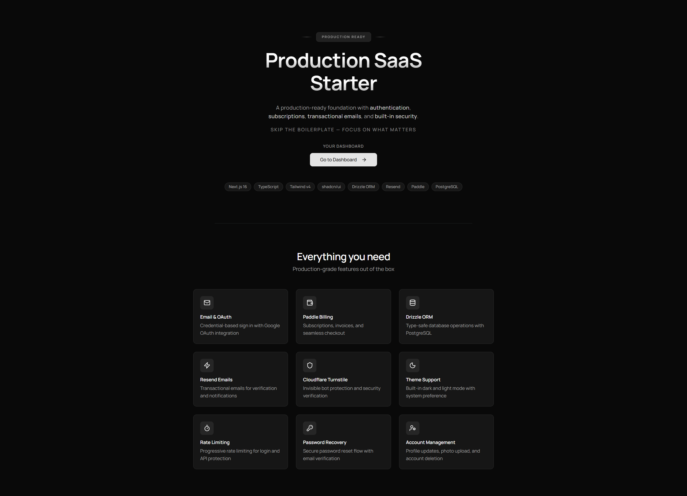

<h1 align="center">Production SaaS Starter</h1>

  A production-ready foundation for building modern SaaS applications — without starting from scratch.

  <a href="https://production-saas-starter.vercel.app" target="_blank">Live Demo →</a>

  

---

This starter includes **authentication**, **payments**, **emails**, and **core security features** out of the box — so you can focus on building your product, not wiring infrastructure.

> Used in production at **<a href="https://lizefy.com" target="_blank">Lizefy</a>** and **<a href="https://glochat.live" target="_blank">GloChat</a>**.

---

## Why This Exists

Most SaaS projects spend weeks or months rebuilding the same basics:

- Authentication
- Password reset flows
- Email setup
- Payments and subscriptions
- Security protections

This starter removes that overhead and gives you a **ready-to-ship foundation** from day one.

---

## Features

- Secure authentication system
- Google OAuth login
- Password reset with email
- Subscription billing with Paddle
- Transactional emails
- Bot protection with Cloudflare Turnstile
- Production-grade security defaults
- Clean, scalable architecture

---

## Tech Stack

### Frontend

| Technology       | Purpose                             |
| ---------------- | ----------------------------------- |
| **Next.js**      | React framework for production apps |
| **TypeScript**   | Type-safe JavaScript                |
| **Tailwind CSS** | Utility-first styling               |
| **shadcn/ui**    | Modern UI components                |

### Backend & Infrastructure

| Technology                | Purpose                     |
| ------------------------- | --------------------------- |
| **Supabase** (PostgreSQL) | Database and auth           |
| **Drizzle ORM**           | Type-safe database queries  |
| **Resend**                | Transactional email service |
| **Cloudflare Turnstile**  | Bot protection              |

### Payments

| Technology | Purpose                             |
| ---------- | ----------------------------------- |
| **Paddle** | Subscription management and billing |

---

## What You Get

- Fully working auth system
- Subscription billing flow
- Email templates and delivery
- Secure database setup
- Clean project structure
- Production-ready defaults

**No boilerplate. No half-finished templates.**
Everything is wired together and ready to deploy.

---

## Use Cases

This starter is ideal for:

- AI tools
- SaaS products
- Internal tools
- Micro-SaaS
- Indie hacker projects
- Startup MVPs

---

  <a href="https://production-saas-starter.vercel.app" target="_blank"><strong>Live Demo →</strong></a>

  Built by <a href="https://abhishekxbharti.com" target="_blank"><strong>Abhishek Bharti</strong></a> 
  <a href="mailto:abhishekxbharti@gmail.com">abhishekxbharti@gmail.com</a> · <a href="https://abhishekxbharti.com" target="_blank">abhishekxbharti.com</a>

